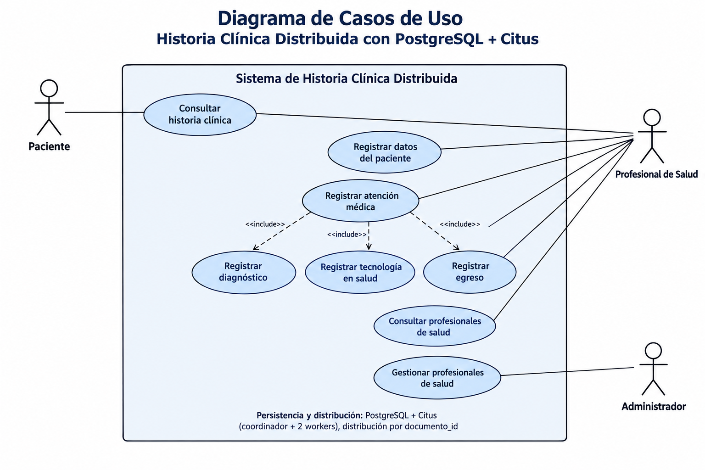

# 📋 Casos de Uso — Historia Clínica Distribuida

## 1. Introducción

El presente documento describe los principales casos de uso del sistema de **Historia Clínica Distribuida**, implementado mediante PostgreSQL y Citus.

El sistema permite gestionar la información relacionada con los pacientes y el flujo de atención médica, incluyendo el registro de pacientes, atenciones, diagnósticos, tecnologías en salud y egresos.

La información se almacena en una arquitectura distribuida utilizando **PostgreSQL + Citus**, donde las tablas relacionadas con los pacientes se distribuyen utilizando `documento_id` como columna de distribución. El clúster está compuesto por un nodo coordinador y dos nodos workers.

---

## 2. Actores del sistema

### 2.1 Paciente

Es la persona a quien pertenece la historia clínica.

Puede:

* Consultar su información clínica.
* Consultar la información relacionada con sus atenciones médicas.
* Consultar los registros asociados a su historia clínica.

### 2.2 Profesional de Salud

Es el médico, especialista u otro profesional encargado de realizar y registrar la atención médica.

Puede:

* Registrar los datos de un paciente.
* Registrar una atención médica.
* Registrar diagnósticos.
* Registrar tecnologías en salud utilizadas durante la atención.
* Registrar el egreso del paciente.
* Consultar historias clínicas.
* Consultar información de otros profesionales de salud.

### 2.3 Administrador

Es el responsable de administrar la información relacionada con los profesionales de salud.

Puede:

* Gestionar profesionales de salud.
* Consultar profesionales registrados.
* Mantener actualizada la información del catálogo de profesionales.

---

## 3. Diagrama de casos de uso

El siguiente diagrama representa la interacción entre los actores y el sistema de Historia Clínica Distribuida.



---

## 4. Casos de uso principales

### CU-01 — Consultar historia clínica

**Actor principal:** Paciente / Profesional de Salud

**Descripción:**
Permite consultar la información clínica asociada a un paciente.

**Precondiciones:**

* El paciente debe existir en el sistema.
* Debe existir información asociada a su documento de identificación.

**Flujo principal:**

1. El actor solicita consultar una historia clínica.
2. El sistema recibe el `documento_id` del paciente.
3. El sistema consulta la información del paciente.
4. El sistema consulta las atenciones asociadas.
5. El sistema consulta los diagnósticos relacionados.
6. El sistema consulta las tecnologías en salud registradas.
7. El sistema consulta la información de egreso cuando exista.
8. El sistema presenta la información de la historia clínica.

**Resultado:**
El actor obtiene la información clínica asociada al paciente.

---

### CU-02 — Registrar datos del paciente

**Actor principal:** Profesional de Salud

**Descripción:**
Permite registrar la información básica y demográfica de un paciente.

**Datos principales:**

* Documento de identificación.
* Nombre completo.
* Fecha de nacimiento.
* Edad.
* Sexo.
* Género.
* Nacionalidad.
* Ocupación.
* Voluntad anticipada.
* Categoría de discapacidad.
* Zona de residencia.

**Flujo principal:**

1. El profesional solicita registrar un paciente.
2. El sistema solicita los datos del paciente.
3. El profesional proporciona la información.
4. El sistema valida el `documento_id`.
5. El sistema registra la información en la entidad `usuario`.
6. Debido a la arquitectura Citus, el registro es distribuido utilizando `documento_id`.

**Resultado:**
El paciente queda registrado en el sistema.

---

### CU-03 — Registrar atención médica

**Actor principal:** Profesional de Salud

**Descripción:**
Permite registrar una atención médica realizada a un paciente.

**Datos principales:**

* Paciente.
* Entidad de salud.
* Fecha de ingreso.
* Modalidad de atención.
* Causa de atención.
* Clasificación de triage.

**Flujo principal:**

1. El profesional identifica al paciente.
2. El sistema verifica que el paciente exista.
3. El profesional registra la información de la atención.
4. El sistema genera el identificador de la atención.
5. El sistema almacena la atención relacionada con el `documento_id`.
6. El sistema mantiene la co-localización de los datos relacionados en Citus.

**Resultado:**
La atención médica queda registrada en la historia clínica.

---

### CU-04 — Registrar diagnóstico

**Actor principal:** Profesional de Salud

**Descripción:**
Permite registrar los diagnósticos asociados a una atención médica.

**Flujo principal:**

1. El profesional selecciona una atención médica.
2. El profesional registra el diagnóstico correspondiente.
3. El sistema relaciona el diagnóstico con el paciente mediante `documento_id`.
4. El sistema relaciona el diagnóstico con la atención mediante `atencion_id`.
5. El diagnóstico queda almacenado en la entidad `diagnostico`.

**Resultado:**
El diagnóstico queda asociado a la atención correspondiente.

---

### CU-05 — Registrar tecnología en salud

**Actor principal:** Profesional de Salud

**Descripción:**
Permite registrar medicamentos y otras tecnologías utilizadas durante una atención.

**Información principal:**

* Paciente.
* Atención.
* Profesional de salud.
* Descripción del medicamento o tecnología.
* Dosis.
* Frecuencia.
* Información relacionada con su aplicación.

**Flujo principal:**

1. El profesional selecciona al paciente.
2. El profesional selecciona la atención correspondiente.
3. Registra la tecnología o medicamento utilizado.
4. Registra la dosis y frecuencia cuando corresponda.
5. El sistema relaciona el registro con el profesional de salud.
6. El sistema almacena la información en `tecnologia_salud`.

**Resultado:**
La tecnología en salud queda registrada dentro de la historia clínica.

---

### CU-06 — Registrar egreso

**Actor principal:** Profesional de Salud

**Descripción:**
Permite registrar la información correspondiente a la salida del paciente del servicio de salud.

**Flujo principal:**

1. El profesional selecciona la atención correspondiente.
2. Registra la información de egreso.
3. Registra la información clínica relacionada con la salida.
4. El sistema relaciona el egreso con el paciente.
5. El sistema almacena la información en la entidad `egreso`.

**Resultado:**
El egreso queda registrado en la historia clínica.

---

### CU-07 — Consultar profesionales de salud

**Actor principal:** Profesional de Salud / Administrador

**Descripción:**
Permite consultar el catálogo de profesionales registrados.

**Información consultable:**

* Identificador del profesional.
* Nombre.
* Especialidad.

**Flujo principal:**

1. El actor solicita consultar los profesionales.
2. El sistema consulta la entidad `profesional_salud`.
3. El sistema devuelve la información disponible.

**Resultado:**
Se presenta el listado de profesionales registrados.

---

### CU-08 — Gestionar profesionales de salud

**Actor principal:** Administrador

**Descripción:**
Permite administrar el catálogo de profesionales de salud utilizado por el sistema.

**Flujo principal:**

1. El administrador accede a la gestión de profesionales.
2. El administrador registra o actualiza la información del profesional.
3. El sistema valida los datos.
4. El sistema almacena la información en `profesional_salud`.
5. La información queda disponible para ser utilizada en los registros clínicos.

**Resultado:**
El catálogo de profesionales se mantiene actualizado.

---

## 5. Relaciones entre casos de uso

El caso de uso **Registrar atención médica** se relaciona con otros casos de uso porque una atención puede involucrar:

* Registro de diagnóstico.
* Registro de tecnologías en salud.
* Registro de egreso.

Conceptualmente:

```text
                 ┌─────────────────────────┐
                 │ Registrar atención      │
                 │        médica            │
                 └────────────┬────────────┘
                              │
                    <<include>>
              ┌───────────────┼───────────────┐
              │               │               │
              ▼               ▼               ▼
       Registrar          Registrar       Registrar
       diagnóstico        tecnología       egreso
                         en salud
```

Esto representa el flujo de información clínica definido por el modelo de datos.

---

## 6. Relación con el modelo de datos

Los casos de uso se relacionan directamente con las entidades existentes en el modelo de datos:

| Caso de uso                   | Entidad relacionada                                                                     |
| ----------------------------- | --------------------------------------------------------------------------------------- |
| Registrar datos del paciente  | `usuario`                                                                               |
| Registrar atención médica     | `atencion`                                                                              |
| Registrar diagnóstico         | `diagnostico`                                                                           |
| Registrar tecnología en salud | `tecnologia_salud`                                                                      |
| Registrar egreso              | `egreso`                                                                                |
| Consultar profesionales       | `profesional_salud`                                                                     |
| Gestionar profesionales       | `profesional_salud`                                                                     |
| Consultar historia clínica    | `usuario`, `atencion`, `diagnostico`, `tecnologia_salud`, `egreso`, `profesional_salud` |

---

## 7. Relación con la arquitectura distribuida

El sistema utiliza PostgreSQL con Citus para distribuir horizontalmente la información.

Las tablas principales relacionadas con el paciente utilizan `documento_id` como columna de distribución:

* `usuario`
* `atencion`
* `tecnologia_salud`
* `diagnostico`
* `egreso`

La tabla `profesional_salud` funciona como tabla de referencia replicada.

La arquitectura está compuesta por:

```text
                         ┌──────────────────────┐
                         │      Aplicación      │
                         └──────────┬───────────┘
                                    │
                                    ▼
                         ┌──────────────────────┐
                         │  Citus Coordinator   │
                         │      PostgreSQL      │
                         └──────────┬───────────┘
                                    │
                       ┌────────────┴────────────┐
                       │                         │
                       ▼                         ▼
              ┌────────────────┐       ┌────────────────┐
              │   Citus Worker │       │   Citus Worker │
              │       1        │       │       2        │
              └────────────────┘       └────────────────┘

                    Distribución por documento_id
```

La distribución por `documento_id` permite mantener los datos relacionados con un mismo paciente co-localizados, facilitando las consultas y JOINs distribuidos.

---

## 8. Resumen de actores y funcionalidades

| Actor                    | Funcionalidades                                                                                                                                                      |
| ------------------------ | -------------------------------------------------------------------------------------------------------------------------------------------------------------------- |
| **Paciente**             | Consultar historia clínica                                                                                                                                           |
| **Profesional de Salud** | Registrar paciente, registrar atención, registrar diagnóstico, registrar tecnología en salud, registrar egreso, consultar historia clínica y consultar profesionales |
| **Administrador**        | Gestionar profesionales y consultar profesionales                                                                                                                    |

---

## 9. Conclusión

Los casos de uso representan las principales operaciones funcionales asociadas al sistema de Historia Clínica Distribuida.

El modelo de casos de uso está relacionado directamente con el modelo entidad-relación y con la arquitectura distribuida implementada mediante PostgreSQL + Citus.

De esta manera, existe correspondencia entre:

**Actores → Casos de uso → Entidades del modelo relacional → Distribución Citus**

Esto permite documentar no solamente la estructura de la base de datos, sino también las interacciones funcionales que justifican el diseño de la solución distribuida.
