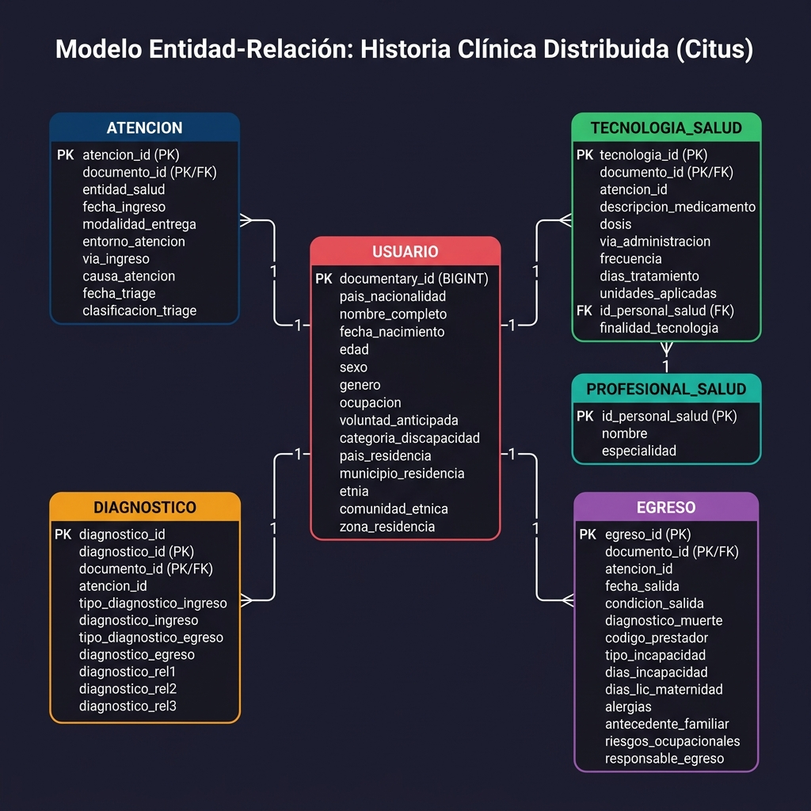

<p align="center">
  
  
  
  
</p>

# 🏥 Historia Clínica Distribuida con PostgreSQL + Citus

> Sistema de base de datos distribuida para la gestión de historias clínicas electrónicas, implementado con **PostgreSQL** y la extensión **Citus** para fragmentación (sharding) y escalado horizontal automático.

---

## 📋 Tabla de Contenidos

- [Descripción](#-descripción)
- [Fundamento Teórico](#-fundamento-teórico)
- [Arquitectura](#-arquitectura)
- [Modelo Entidad-Relación](#-modelo-entidad-relación)
- [Estructura del Proyecto](#-estructura-del-proyecto)
- [Requisitos Previos](#-requisitos-previos)
- [Instalación y Despliegue](#-instalación-y-despliegue)
- [Consultas de Validación](#-consultas-de-validación)
- [Esquema de la Base de Datos](#-esquema-de-la-base-de-datos)
- [Detener y Limpiar](#-detener-y-limpiar)
- [Tecnologías Utilizadas](#-tecnologías-utilizadas)
- [Autor](#-autor)
- [Licencia](#-licencia)

---

## 📖 Descripción

Este proyecto implementa una **base de datos distribuida real** para la gestión de historias clínicas electrónicas, utilizando PostgreSQL con la extensión **Citus**. El sistema permite:

- 🔀 **Fragmentar automáticamente** los datos de pacientes en múltiples nodos (sharding por `documento_id`).
- 📊 **Distribuir consultas** de forma transparente entre un nodo coordinador y dos workers.
- 🔗 **Mantener integridad referencial** entre tablas distribuidas mediante co-localización de datos.
- 📋 **Replicar tablas de referencia** (como `profesional_salud`) en todos los nodos para optimizar JOINs.

El dominio de datos modela el flujo completo de una atención médica: desde la identificación del paciente, pasando por la atención, diagnóstico y tecnologías en salud aplicadas, hasta el egreso del servicio.

---

## 📚 Fundamento Teórico

### ¿Qué es una Base de Datos Distribuida?

Un **sistema de bases de datos distribuidas** es un conjunto de múltiples bases de datos lógicamente relacionadas, dispersas en diferentes nodos físicos y conectadas por una red. Aunque los datos están distribuidos, el sistema se presenta al usuario como una **sola unidad unificada y coherente**.

| Característica | Descripción |
|---|---|
| **Distribución** | Los nodos pueden ser servidores separados geográficamente o máquinas virtuales |
| **Autonomía Local** | Cada sitio puede procesar datos de manera local e independiente |
| **Transparencia** | El usuario no necesita saber dónde residen los datos para acceder a ellos |

### Ventajas

| Ventaja | Descripción |
|---|---|
| 📈 **Escalabilidad** | Escalar horizontalmente agregando más nodos al clúster |
| 🛡️ **Tolerancia a fallos** | Si un nodo falla, el sistema sigue funcionando mediante réplicas |
| ⚡ **Rendimiento** | Menor latencia al acceder a datos locales y procesamiento paralelo |

### ¿Qué es Citus?

**[Citus](https://www.citusdata.com/)** es la extensión líder para convertir PostgreSQL en una base de datos distribuida mediante **sharding** de datos en múltiples nodos. Es ideal para:

- Aplicaciones SaaS multi-inquilino
- Análisis de datos en tiempo real
- Sistemas que necesitan escalado horizontal manteniendo la compatibilidad SQL completa

---

## 🏗️ Arquitectura

El clúster está compuesto por **3 nodos** Docker que se comunican a través de una red interna:

```
                    ┌──────────────────────────────────┐
                    │       COORDINADOR (Citus)         │
                    │   Puerto externo: 5436 → 5432     │
                    │   • Recibe todas las consultas     │
                    │   • Planifica y distribuye queries  │
                    │   • Agrega resultados              │
                    └──────────┬──────────┬──────────────┘
                               │          │
                  ┌────────────┘          └─────────────┐
                  │                                     │
         ┌────────▼─────────┐              ┌────────────▼────────┐
         │   WORKER 1       │              │   WORKER 2          │
         │   Puerto: 5432   │              │   Puerto: 5432      │
         │   • Shards pares │              │   • Shards impares  │
         │   • Almacena     │              │   • Almacena        │
         │     fragmentos   │              │     fragmentos      │
         └──────────────────┘              └─────────────────────┘
```

### Estrategia de Distribución

| Tabla | Tipo | Columna de distribución | Descripción |
|---|---|---|---|
| `usuario` | Distribuida | `documento_id` | Tabla principal de pacientes |
| `atencion` | Distribuida | `documento_id` | Atenciones médicas co-localizadas con usuario |
| `tecnologia_salud` | Distribuida | `documento_id` | Medicamentos y tecnologías aplicadas |
| `diagnostico` | Distribuida | `documento_id` | Diagnósticos de ingreso y egreso |
| `egreso` | Distribuida | `documento_id` | Información de salida del paciente |
| `profesional_salud` | Replicada | — | Copia completa en cada worker |

> 💡 **Co-localización:** Todas las tablas distribuidas usan `documento_id` como columna de distribución, lo que garantiza que los datos de un mismo paciente residan en el mismo shard, optimizando los JOINs distribuidos.

---

## 📐 Modelo Entidad-Relación

<p align="center">
  
</p>

El modelo consta de **6 tablas** interrelacionadas que representan el flujo completo de una atención médica:

1. **`usuario`** → Datos demográficos del paciente (tabla central).
2. **`atencion`** → Registro de cada atención médica recibida.
3. **`tecnologia_salud`** → Medicamentos y tecnologías aplicadas durante la atención.
4. **`diagnostico`** → Diagnósticos de ingreso, egreso y relacionados.
5. **`egreso`** → Información de salida, incapacidades y antecedentes.
6. **`profesional_salud`** → Catálogo de profesionales de salud (tabla de referencia).

---

## 📁 Estructura del Proyecto

```
historia_clinica_distribuida_citus/
│
├── 📄 docker-compose-citus.yml   # Orquestación de contenedores (coordinador + 2 workers)
├── 🔧 init-citus.sh              # Script de inicialización automática del clúster
├── 🗃️ schema_citus.sql           # Esquema DDL con tablas distribuidas y replicadas
├── 📊 insert_datos.sql           # Datos de ejemplo para las 6 tablas (10 pacientes)
├── 🖼️ MER_historia_clinica.png   # Diagrama Entidad-Relación del modelo de datos
└── 📖 README.md                  # Documentación del proyecto
```

---

## ✅ Requisitos Previos

Antes de comenzar, asegúrate de tener instalados los siguientes componentes:

| Herramienta | Versión mínima | Descripción |
|---|---|---|
| [Docker](https://docs.docker.com/get-docker/) | 20.10+ | Motor de contenedores |
| [Docker Compose](https://docs.docker.com/compose/install/) | 2.0+ | Orquestación de contenedores |
| [Git](https://git-scm.com/) | 2.30+ | Control de versiones |
| Bash | 4.0+ | Shell para el script de inicialización |

---

## 🚀 Instalación y Despliegue

### 1. Clonar el repositorio

```bash
git clone https://github.com/JuanGTapiaG/historia_clinica_distribuida_citus.git
cd historia_clinica_distribuida_citus
```

### 2. Levantar los servicios con Docker Compose

```bash
docker-compose -f docker-compose-citus.yml up -d
```

Esto levanta **3 contenedores**:

| Contenedor | Rol | Puerto |
|---|---|---|
| `citus_coordinator` | Nodo coordinador | `5436` (mapeado al `5432` interno) |
| `citus_worker1` | Worker 1 | Solo accesible en red interna |
| `citus_worker2` | Worker 2 | Solo accesible en red interna |

### 3. Inicializar el clúster

Ejecuta el script de inicialización que configura todo automáticamente:

```bash
bash init-citus.sh
```

El script realiza los siguientes pasos:

```
[1/5] ⏳ Esperando a que el coordinador esté listo...
[2/5] ⏳ Esperando a que los workers estén listos...
[3/5] 🔌 Creando extensión Citus y registrando workers...
[4/5] 🗃️ Creando esquema distribuido (tablas y shards)...
[5/5] 📊 Insertando datos de ejemplo...
  ✔ Cluster Citus inicializado correctamente
```

### 4. Conectarse al coordinador

```bash
docker exec -it citus_coordinator psql -U admin -d historia_clinica
```

### 5. (Alternativa) Inicialización manual

Si prefieres ejecutar los pasos manualmente:

```bash
# Crear extensión Citus
docker exec -it citus_coordinator psql -U admin -d historia_clinica \
  -c "CREATE EXTENSION IF NOT EXISTS citus;"

# Registrar workers
docker exec -it citus_coordinator psql -U admin -d historia_clinica \
  -c "SELECT citus_add_node('citus_worker1', 5432);"
docker exec -it citus_coordinator psql -U admin -d historia_clinica \
  -c "SELECT citus_add_node('citus_worker2', 5432);"

# Crear esquema distribuido
docker exec -i citus_coordinator psql -U admin -d historia_clinica < schema_citus.sql

# Insertar datos de ejemplo
docker exec -i citus_coordinator psql -U admin -d historia_clinica < insert_datos.sql
```

---

## 🔍 Consultas de Validación

Una vez inicializado el clúster, puedes ejecutar las siguientes consultas para verificar su correcto funcionamiento:

### Verificar workers activos

```sql
SELECT * FROM citus_get_active_worker_nodes();
```

**Resultado esperado:** 2 workers registrados (`citus_worker1` y `citus_worker2`).

### Ver tablas distribuidas

```sql
SELECT * FROM citus_tables;
```

### Consulta simple distribuida

```sql
SELECT nombre_completo, documento_id, sexo, edad
FROM usuario
WHERE documento_id > 0;
```

### Consulta con JOINs distribuidos (co-localizados)

```sql
SELECT
    u.nombre_completo,
    u.documento_id,
    a.entidad_salud,
    a.causa_atencion,
    d.diagnostico_ingreso,
    d.diagnostico_egreso
FROM usuario u
JOIN atencion a ON u.documento_id = a.documento_id
JOIN diagnostico d ON u.documento_id = d.documento_id
    AND a.atencion_id = d.atencion_id
ORDER BY a.fecha_ingreso;
```

### Consulta con tabla replicada

```sql
SELECT
    u.nombre_completo,
    ts.descripcion_medicamento,
    ts.dosis,
    ts.frecuencia,
    ps.nombre AS profesional,
    ps.especialidad
FROM usuario u
JOIN tecnologia_salud ts ON u.documento_id = ts.documento_id
JOIN profesional_salud ps ON ts.id_personal_salud = ps.id_personal_salud
ORDER BY u.nombre_completo;
```

### Verificar distribución de shards

```sql
SELECT
    logicalrelid AS tabla,
    shardid,
    nodename AS nodo,
    nodeport AS puerto
FROM citus_shards
ORDER BY logicalrelid, shardid;
```

---

## 🗃️ Esquema de la Base de Datos

### Tabla `usuario` (distribuida)

| Columna | Tipo | Descripción |
|---|---|---|
| `documento_id` | `BIGINT` PK | Identificador único del paciente |
| `pais_nacionalidad` | `VARCHAR(100)` | País de nacionalidad |
| `nombre_completo` | `VARCHAR(255)` | Nombre completo del paciente |
| `fecha_nacimiento` | `DATE` | Fecha de nacimiento |
| `edad` | `INT` | Edad del paciente |
| `sexo` | `VARCHAR(10)` | Sexo biológico |
| `genero` | `VARCHAR(20)` | Identidad de género |
| `ocupacion` | `VARCHAR(100)` | Ocupación actual |
| `voluntad_anticipada` | `BOOLEAN` | Si tiene voluntad anticipada |
| `categoria_discapacidad` | `VARCHAR(50)` | Categoría de discapacidad |
| `zona_residencia` | `VARCHAR(50)` | Zona (Urbana/Rural) |

### Tabla `atencion` (distribuida)

| Columna | Tipo | Descripción |
|---|---|---|
| `atencion_id` | `SERIAL` | Identificador de la atención |
| `documento_id` | `BIGINT` PK/FK | Referencia al paciente |
| `entidad_salud` | `VARCHAR(255)` | Institución de salud |
| `fecha_ingreso` | `TIMESTAMP` | Fecha y hora de ingreso |
| `modalidad_entrega` | `VARCHAR(50)` | Presencial / Telemedicina |
| `causa_atencion` | `TEXT` | Motivo de la atención |
| `clasificacion_triage` | `VARCHAR(10)` | Clasificación de urgencia (I-V) |

### Tabla `profesional_salud` (replicada)

| Columna | Tipo | Descripción |
|---|---|---|
| `id_personal_salud` | `UUID` PK | Identificador único del profesional |
| `nombre` | `VARCHAR(255)` | Nombre del profesional |
| `especialidad` | `VARCHAR(100)` | Especialidad médica |

---

## 🧹 Detener y Limpiar

```bash
# Detener contenedores (conserva datos)
docker-compose -f docker-compose-citus.yml down

# Detener y eliminar volúmenes (⚠️ borra todos los datos)
docker-compose -f docker-compose-citus.yml down -v
```

---

## 🛠️ Tecnologías Utilizadas

| Tecnología | Versión | Uso |
|---|---|---|
| **PostgreSQL** | 14+ | Motor de base de datos relacional |
| **Citus** | 11.2 | Extensión de distribución y sharding |
| **Docker** | 20.10+ | Contenerización de servicios |
| **Docker Compose** | 2.0+ | Orquestación multi-contenedor |
| **Bash** | 4.0+ | Automatización de la inicialización |

---

## 👤 Autor

**Juan G. Tapia G.**

- GitHub: [@JuanGTapiaG](https://github.com/JuanGTapiaG)

---

## 📄 Licencia

Este proyecto es de uso académico y educativo. Siéntete libre de usarlo como referencia para aprender sobre bases de datos distribuidas con PostgreSQL y Citus.

---

<p align="center">
  <i>Desarrollado como laboratorio de Bases de Datos Distribuidas</i>
  <br/>
  
  
</p>
